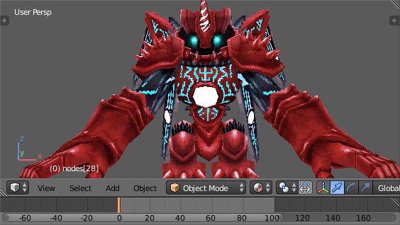

<h3 align=center>apicula</h3>

 
Rip models from DS games.

-----

apicula can rip, view, and convert the [NSBMD model
files](https://github.com/scurest/apicula/wiki/FILETYPES) found in many Nintendo
DS games.

* [Tutorial](https://github.com/scurest/apicula/wiki/TUTORIAL)
* [Hallow's tutorial on VG Resource](https://www.vg-resource.com/thread-32332.html)
* [Common Blender issues](https://github.com/scurest/apicula/wiki/IMPORT:-Blender)
* [Programmer's documentation on .nsbXX files](https://raw.githubusercontent.com/scurest/nsbmd_docs/master/nsbmd_docs.txt)

### Compatibility

apicula recognized these file types (called Nitro files). See [the
wiki](https://github.com/scurest/apicula/wiki/FILETYPES) for more info.

* `.nsbmd`, `.BMD`, or `.BMD0`: 3D models, textures, palettes
* `.nsbtx`, `.BTX`, or `.BTX0`: textures, palettes
* `.nsbca`, `.BCA`, or `.BCA0`: joint animations
* `.nsbtp`, `.BTP`, or `.BTP0`: pattern animations (flipbook-type)
* `.nsbta`, `.BTA`, or `.BTA0`: material animations (experimental!!)

Models can be converted to COLLADA or glTF.

Pattern animations are supported in the viewer and extractor, but not in the
converter (neither COLLADA nor glTF support animations that change a material's
textures).

Material animations are supported in the viewer and extractor, but not in the
converter.

Importing apicula's COLLADA files has been tested in Blender and Maya.

### Downloads

* [Download for Windows, 64-bit](https://github.com/scurest/apicula/releases/download/continuous/apicula-latest-windows.zip)

This is built automatically off the latest `master`. You may need one of the Visual Studio
Redistributable packages installed.

### Building

Make sure [Rust (1.34+) is installed](https://rustup.rs/) and [build the usual
way](https://doc.rust-lang.org/cargo/guide/working-on-an-existing-project.html)

    $ git clone https://github.com/scurest/apicula.git
    $ cd apicula
    $ cargo b --release
    $ target/release/apicula -V

### Usage

To search a ROM (or any other file) for Nitro files and extract them

    apicula extract <INPUT FILE> -o <OUTPUT DIR>

To view models

    apicula view <NITRO FILES>

To convert models to COLLADA `.dae` files

    apicula convert <NITRO FILES> -o <OUTPUT DIR>

To convert models to glTF `.glb` files

    apicula convert -f=glb <NITRO FILES> -o <OUTPUT DIR>

To get technical information about the given Nitro files

    apicula info <NITRO FILES>

To receive further help

    apicula help

See also the [tutorial](https://github.com/scurest/apicula/wiki/TUTORIAL) on the
process of extracting .nsbXX files from a ROM, converting them to COLLADA, and
importing them into Blender.

### Special Thanks

* **kiwi.ds**, for models and documentation for Nitro formats. All NDS model viewers seem to be
  derived from this one. Now defunct.

* **Gericom's [MKDS Course Modifier](https://gbatemp.net/threads/mkds-course-modifier.299444/)**,
  for animation information, especially for the meaning of the basis rotations.

* **Lowlines' [Console
  Tool](https://web.archive.org/web/20180319005030/http://llref.emutalk.net/projects/ctool/)**,
  for animations and documentation for Nitro formats. I also used Console Tool
  for extracting files from ROMs.

* **Barubary's [DSDecmp](https://github.com/Barubary/dsdecmp)** for NDS
  decompression algorithms.

* **[GBATEK](http://problemkaputt.de/gbatek.htm#ds3dvideo)**, for DS hardware documentation.

* **[deSmuME](http://desmume.org/)**, for the DS debugger. `_3D_LOG_EXEC` and the GDB stub were
  invaluable.

### License

0BSD
